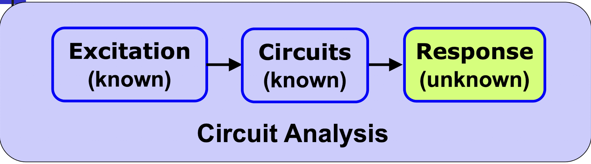
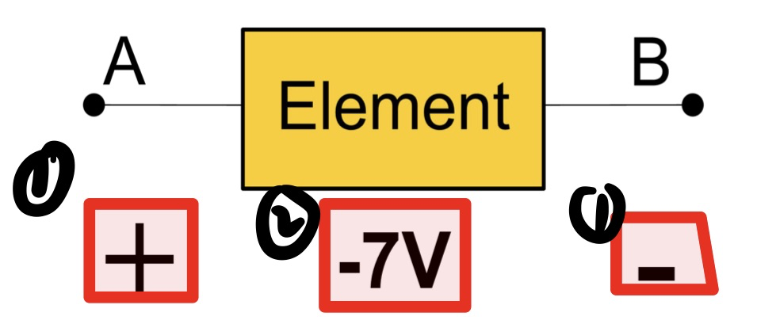
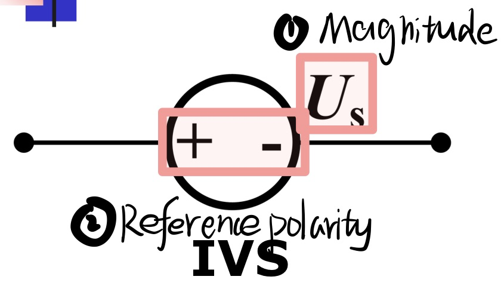

# Introduction to Electronic Systems

-----

## 🤡Part 1: <mark><u>Resistive Circuit Analysis</u></mark>

------

#### 1.Circuit Variables and Circuit Elements

#####     1-1 Circuit Variables

- Electric Charge

- Current
  
  -------
  
  $$
  \bbox[pink]{
  i(t) = \frac{dq(t)}{d(t)}
  }
  $$

  | i : current in A(Ampere)                           |
  | -------------------------------------------------- |
  | **q : charge in C(Coulomb) unit:-1.602 *10^-19 C** |
  | **t : time in s**                                  |
  
   
  
- Voltage
  
  --------
  
  $$
  \bbox[pink]{
  u = \frac{dw}{dq}
  }
  $$

  | u : voltage in V    |
  | ------------------- |
  | **w : energy in J** |
  | **q : charge in C** |
  
  

#####     1-2 Circuit Elements

- Ideal Basic Circuit Element

- Passive sign Convention

- Resistor(Ohm's Law,VCR(voltage current relation))

  > Ohm's Law with PSC

  $$
  \bbox[pink]{
      e^x=\lim_{n\to\infty} \left( 1+\frac{x}{n} \right)^n \qquad (1)
  }
  $$
  

-----

#####     1-3 Power and Energy

- Conductance

  | Rsistor can alos be characterized by Conductance |
  | ------------------------------------------------ |
  | Conductance is mustered in **Siemens(S)**        |
  
  $$
  \bbox[pink]{
      i = Gu\qquad \qquad G = \frac{1}{R}
  }
  $$
  
  

------

- Power

  > **Power** is defined as **the time rate** of expending or absorbing energy, and expressed as:

  $$
  \bbox[pink]{
  \begin{aligned}
  p &= \frac{dw}{dt} \\
    &= (\frac{dw}{dq})(\frac{dq}{dt})\\
    &= u i
  \end{aligned}
  }
  $$

- Energy

  ----

  $$
  \bbox[pink]{
  w= \int_\infty^tp(t)dt
  }
  $$

- Passtive and Active Element

  -----

  $$
  \bbox[pink]{
  w= \int_\infty^tp(t)dt
  }
  $$

  $$
  \bbox[pink]{
  w= \int_\infty^tp(t)dt = \int_\infty^tu(t)i(t)dt
  }
  $$

  | Passive :    | w >= 0  |
  | ------------ | ------- |
  | **Active :** | **w<0** |

  > **Rsistor**
  
  $$
  \bbox[pink]{
  p = i^2R =v^2/R\geq0
  }
  $$
  
  > A **resistor** always **absorbs** power from the circuit.
  
  $$
  \bbox[pink]{
  w= \int_\infty^tp(t)dt = \int_\infty^t i^2Rdt = \int_\infty^tv^2/Rdt\geq0
  }
  $$
  
  > Resistor is a **passive** element

---

#####     1-4 Voltage and Current Source

- Independent source

  | IVS(  Independent Voltage Source)                            |
  | ------------------------------------------------------------ |
  | A **prescribed** voltage, **regardless of** current flowing in its terminals |

   

  | ICS( Independent Current Source)                             |
  | ------------------------------------------------------------ |
  | A **prescribed** voltage, **regardless of** voltage across its terminals |

   

---

- Dependent source( Controlled source)

   

  >**K**, **g**, **r** are all **const** factors
  >
  >> K is a **dimensionless scaling** factor
  >>
  >> g is a factor with unit of A/V
  >>
  >> r is a factor with unit of V/A.

##### 🌟Summary of Chapter 1

##### 👉HOMEWORK👈

----

#### 2.Simple Resistive Circuit Analysis

#####     2-1 Kirchhoff's Laws🔥

- Definitions for Circuit Topplogy

  > **NODE**

  | A point which two or more elements. |
  | ----------------------------------- |
  | **Essential** NODE : three or more  |

  > **PATH**

  | A PATH is a trace of adjoining basic elements with no intermediate nodes. |
  | ------------------------------------------------------------ |

  > **LOOP**

  | A LOOP is a path whose last node is the same as the starting node ,or a closed path. |
  | ------------------------------------------------------------ |

  > **BRANCH**

  | A BRANCH is defined as a path that connects two adjoining nodes |
  | ------------------------------------------------------------ |
  | **Essential** branch: connects two essential nodes whithout passing through any essential node. |

  > **MESH**

  | A MESH is : defined as a loop that does not contain any other loops within it |
  | ------------------------------------------------------------ |

  | MESH does not enclose any branches. |
  | ----------------------------------- |

-----

- **kirchhoff's Current Law**

  > **KCL**

  | The <mark>algebraic</mark> sum of all the currents entering any node in a curcuit is 0. |
  | ------------------------------------------------------------ |

  $$
  \bbox[pink]{
  \sum_{n=1}^Ni_n(t)=0
  }
  $$

  > **Generalization of KCL**

  | The algebraic sum of all the currents entering any <mark>closed surface</mark> is zero |
  | ------------------------------------------------------------ |

   

---

- **kirchhoff's Voltage Law**

> **KVL**

| The algebraic sum of all the voltages around any loop in a circuit is ZERO. |
| ------------------------------------------------------------ |

$$
\bbox[pink]{
\sum_{n=1}^Nv_n(t)=0
}
$$

---

- <mark>**Check**</mark> the answer by power balance**
  $$
  \bbox[pink]{
  p_{dissipated}=p_{developed}
  }
  $$

  | Power is balanced, and the answer is reasonable! |
  | ------------------------------------------------ |

----

- **Conservation of Charge**  ➡️   **KCL**
- **Conservation of Energy**  ➡️   **KVL**

---

#####     2-2 Analysis of Simple Circuit Containing Controlled Sources

> **EXAMPLE**

 

 

---

##### 2-3 Resistors In Series and parallel

- **Resistors in Series**

  > all elements carry the **SAME** **current** are said to be connected in series.

  $$
  \bbox[pink]{
  R_{eq} = \sum_{k=1}^NR_k
  }
  $$

---

- Resistors in Parallel**

  > all elements have the **SAME** **voltage** across them are said to be connected in parallel.

  $$
  \bbox[pink]{
  \frac{1}{R_{eq}}=\sum_{k=1}{N}\frac{1}{R_k}
  }
  $$

---

##### 🌟Summary of Chapter 2

##### 👉HOMEWORK👈

----

#### 3.Techniques of Circuit Analysis

> **THEOREM 1**
>
> > For a circuit with **n** nodes
> >
> > -  KCL yields <mark>**(n-1)**</mark>mark> independent equations for any **(n-1)** nodes
>
> **THOREM 2**
>
> > For a circuit with **n** nodes and b branches
> >
> > - The curcuit must have <mark>**m = b - (n - 1)** </mark>meshes
> > - KVL yields <mark>**m = b - (n - 1)**</mark> independent equations for the  <mark>**m = b - (n - 1)**</mark> meshes

---

#####     3-1 Node-Voltage Analysis Method

> **NODE VOLTAGE**
>
> - defined as the voltage rise from the reference node
> - Voltage across all branches can be represented by node voltages

 

----

- **Implementing**

  > **STEP 1:**
  >
  > Select one of the nodes as the reference node, and define node voltages for other nodes
  >
  > **STEP 2:**
  >
  > Build KCL equations for nodes except the reference node
  >
  > **STEP 3:**
  >
  > Solve equations for the node voltages
  >
  > **STEP 4:**
  >
  > Determine required voltages, currents or powers by node voltages

---

- **EXAMPLE**

 

 

- **Super Node**

  😛[SUPER NODE EXPLAIN](https://www.google.com/search?q=what%27s+the+super+node&rlz=1C5CHFA_enUS1035US1035&oq=what%27s+the+super+node&aqs=chrome..69i57j0i10i512l2j46i10i340i512l2j0i10i512l4.5467j0j15&sourceid=chrome&ie=UTF-8#fpstate=ive&vld=cid:d9bd7f68,vid:khtZubT9K8E)

   

   

#####     3-2 Mesh-Current Analysis Method

> **MESH-CURRENT**
>
> - An imaginary quantity
> - flows around a mesh
> - All branch currents do not change for introducing mesh currents
> - All branch currents can be represented by mesh currents

#####     3-3  Superposition Theorem

#####     3-5 Source Transformation

#####     3-6 Maximum Power Transfer

##### 🌟Summary of Chapter 3

##### 👉HOMEWORK👈

#### 4.Operational Amplifier

#####     4-1 Operational Amplifier

#####     4-2 Simple Operational Amplifier

##### 🌟Summary of Chapter 4

## 🤡Part 2: <u><mark>DynamicCircuit Analysis</mark></u>

#### 5.Capacitors and Inductors

#####     5-1 Capacitors and Capacitances

#####     5-2 Inductors and Inductances

#####     5-3 Dynamic Elements and Circuit

##### 🌟Summary of Chapter 5

##### 👉HOMEWORK👈

#### 6.Response of First-order RC and RL Circuits

#####     6-1 RC and RL circuits

#####     6-2 Initial Values

#####     6-3 Natural Response

#####     6-4 Step Response

#####     6-5 General Solution Method

##### 6-6 Integrating Amplifier

##### 🌟Summary of Chapter 6

##### 👉HOMEWORK👈

#### 7.Response of Secound-order RLC Circuits*

## 🤡Part 3: <u><mark>Sinusoidal Steady-State Analysis</mark></u>

#### 8.Sinusoidal Steady-State Analysis

#### 9.Sinusoidal Steady-State Power Calculations

#### 10.Frequency Selective Circuits*

##### 🌟Summary of Chapter 7

##### 👉HOMEWORK👈
